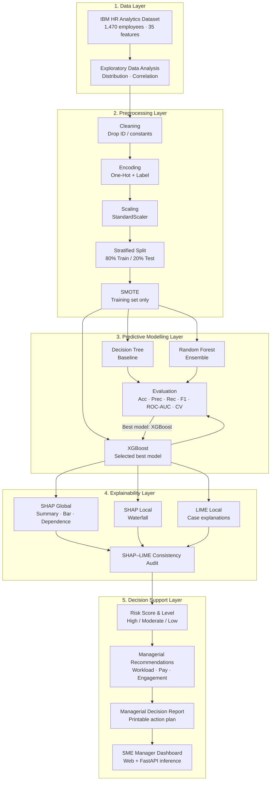
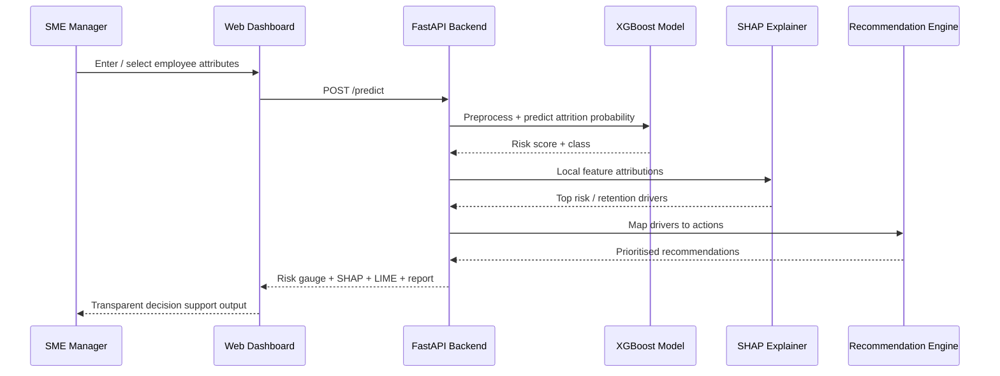

# Figure 4.1 — Framework Architecture

> **Paste instruction:** Render this Mermaid diagram (GitHub, VS Code, mermaid.live, or export to PNG/SVG) and insert as **Figure 4.1** in Chapter 4, Section 4.12.  
> Leave a blank figure slot in the Word report: `[INSERT FIGURE 4.1: Framework Architecture]`

## Mermaid (system architecture)

## Mermaid (end-to-end inference flow for one employee)

## Caption (for Word)

**Figure 4.1:** Architecture of the proposed Explainable AI (XAI) framework for managerial decision-making in SMEs. The pipeline integrates data preprocessing, multi-model prediction, dual SHAP/LIME explainability, and a managerial decision-support reporting layer.
